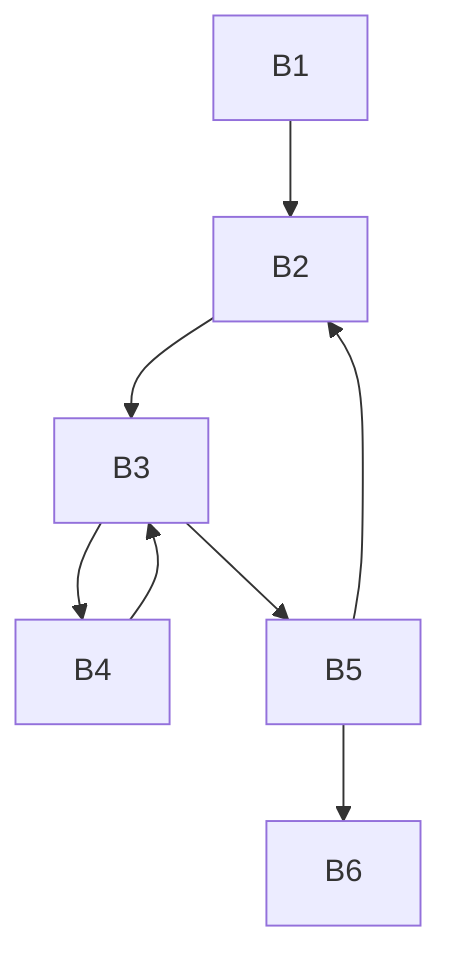
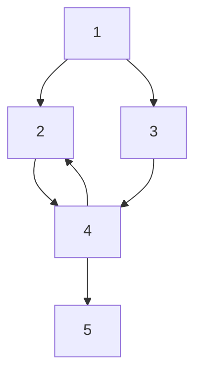
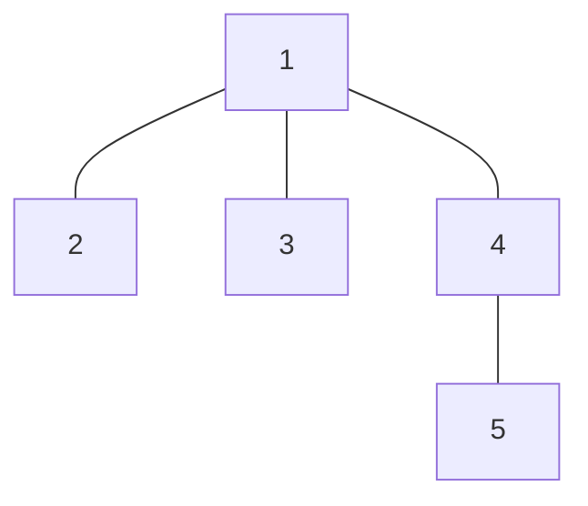
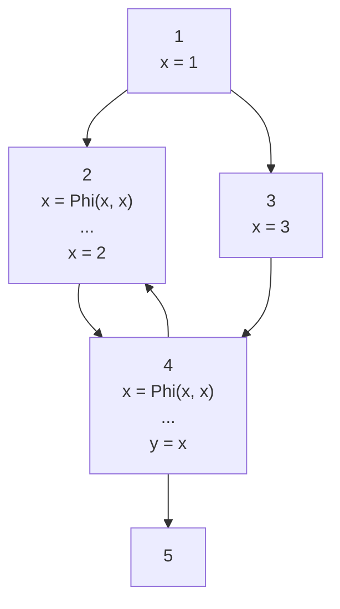
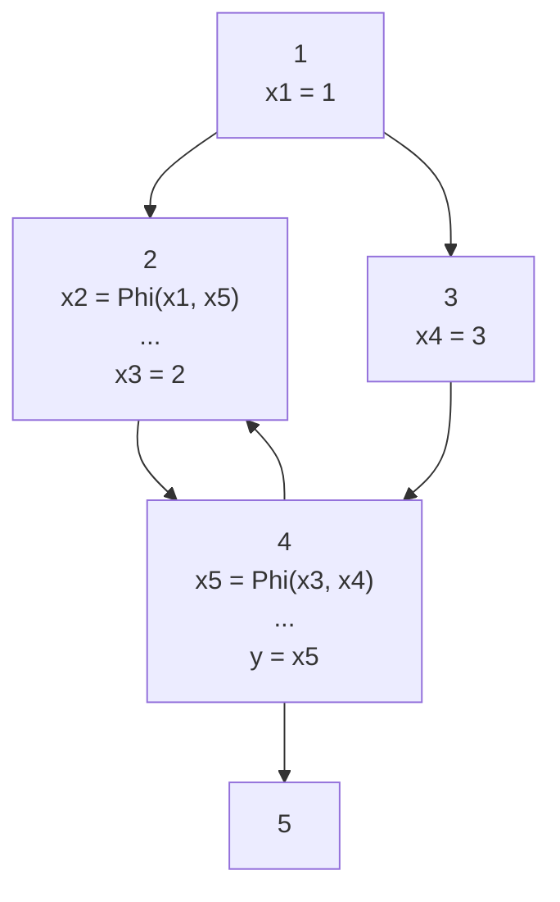
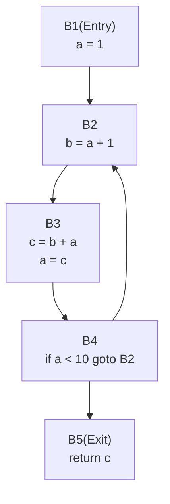
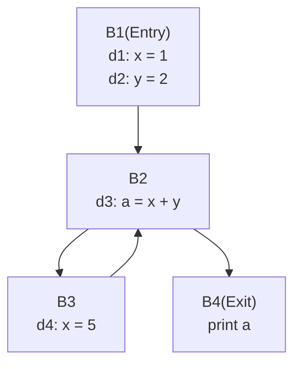

## **模拟题 1：LL(1) 语法分析综合题**

背景：给定如下上下文无关文法 $G$（其中 $E$ 为开始符号，id, +, *, (, ) 为终结符）：

$$E \rightarrow E + T \mid T$$

$$T \rightarrow T * F \mid F$$

$$F \rightarrow ( E ) \mid id$$

**问题**：

1. **预处理**：上述文法适合直接进行自上而下的预测分析吗？如果不适合，请对其进行**消除左递归**操作，写出改写后的文法。
2. **集合计算**：对改写后的文法，计算所有非终结符的 **FIRST 集** 和 **FOLLOW 集**。
3. **表构造**：构造该文法的 **LL(1) 预测分析表**。
4. **模拟执行**：给定输入串 `id + id * id`，请写出分析栈的推导过程。

------

### **详细讲解与参考答案**

#### **1. 消除左递归**

> * **自上而下的方法不能处理左递归的文法**！
> * 消除左递归的**规则**：将 $A \rightarrow A\alpha \mid \beta$ 替换为 $A \rightarrow \beta A'$ 和 $A' \rightarrow \alpha A' \mid \epsilon$。

原题中，$E \rightarrow E + T$ 和 $T \rightarrow T * F$ 都是直接左递归（形式为 $A \rightarrow A\alpha \mid \beta$），我们需要引入新的非终结符（$E'$ 和 $T'$）将左递归转换为右递归。

**结果（改写后的文法）**：

1. $E \rightarrow T E'$
2. $E' \rightarrow + T E' \mid \epsilon$
3. $T \rightarrow F T'$
4. $T' \rightarrow * F T' \mid \epsilon$
5. $F \rightarrow ( E ) \mid id$

------

#### **2. 计算 FIRST 集 和 FOLLOW 集**

> FIRST 集 和 FOLLOW 集是构造分析表的基石。
>
> * **FIRST(X)**： 从 X 推导出的串的第一个终结符的集合
> * **FOLLOW(A)**：在句型中紧跟在 A 后面的终结符的集合

**解题步骤**：

**FIRST 集计算**：

- $FIRST(F) = \{(, id\}$ （直接看产生式 5）
- $FIRST(T) = FIRST(F) = \{(, id\}$ （因为 $T \rightarrow F...$）
- $FIRST(E) = FIRST(T) = \{(, id\}$ （因为 $E \rightarrow T...$）
- $FIRST(E') = \{+, \epsilon\}$ （直接看产生式 2）
- $FIRST(T') = \{*, \epsilon\}$ （直接看产生式 4）

**FOLLOW 集计算**：

- **FOLLOW(E)**：
  - $E$ 是开始符号，加入 $\$$ 。
  - 看 $F \rightarrow ( E )$，由此 $E$ 后面跟着 `)`。
  - **结果**：$\{), \$\}$
- **FOLLOW(E')**：
  - $E'$ 只出现在 $E \rightarrow T E'$ 和 $E' \rightarrow ...E'$ 的末尾。
  - 根据规则，FOLLOW(E') 继承 FOLLOW(E)。
  - **结果**：$\{), \$\}$
- **FOLLOW(T)**：
  - 看 $E \rightarrow T E'$ 和 $E' \rightarrow + T E'$。$T$ 后面紧跟 $FIRST(E')$。
  - $FIRST(E') = \{+, \epsilon\}$。
  - 遇到 $+$：加入 $+$。
  - 遇到 $\epsilon$：$T$ 变成了 $E'$ 的结尾，继承 $FOLLOW(E')$（即 $FOLLOW(E)$）。
  - **结果**：$\{+, ), \$\}$
- **FOLLOW(T')**：
  - 同理，$T'$ 出现在 $T$ 的末尾，继承 $FOLLOW(T)$。
  - **结果**：$\{+, ), \$\}$
- **FOLLOW(F)**：
  - 看 $T \rightarrow F T'$，$F$ 后面紧跟 $FIRST(T')$。
  - $FIRST(T') = \{*, \epsilon\}$。加入 $*$ 并继承 $FOLLOW(T)$。
  - **结果**：$\{*, +, ), \$\}$

------

#### **3. 构造预测分析表**

> 要点分析
>
> * 对于 $A \rightarrow \alpha$，对 $FIRST(\alpha)$ 中的每个终结符 $a$，填入 $M[A, a]$
> * 如果 $\alpha$ 能推导出 $\epsilon$（即 $\epsilon \in FIRST(\alpha)$），则对 $FOLLOW(A)$ 中的每个符号 $b$，填入 $M[A, b]$ （**这是最容易丢分的地方！**）

| **非终结符** | **id**      | **+**             | *****         | **(**       | **)**             | **$**             |
| ------------ | ----------- | ----------------- | ------------- | ----------- | ----------------- | ----------------- |
| **E**        | $E \to TE'$ |                   |               | $E \to TE'$ |                   |                   |
| **E'**       |             | $E' \to +TE'$     |               |             | $E' \to \epsilon$ | $E' \to \epsilon$ |
| **T**        | $T \to FT'$ |                   |               | $T \to FT'$ |                   |                   |
| **T'**       |             | $T' \to \epsilon$ | $T' \to *FT'$ |             | $T' \to \epsilon$ | $T' \to \epsilon$ |
| **F**        | $F \to id$  |                   |               | $F \to (E)$ |                   |                   |

------

#### **4. 栈分析过程 (Trace)**

> * **初始状态**：栈底为 \$，栈顶为开始符号 $E$。输入为 `id+id*id$`
> * **匹配规则**：
>   - 栈顶是非终结符：查表，**反向压栈**（例如 $E \rightarrow TE'$，先压 $E'$ 再压 $T$）。
>   - 栈顶是终结符：与输入匹配，弹出。

**推导过程**：

| **栈 (Stack)**  | **输入 (Input)** | **动作 / 输出 (Output)**  | **解释**                         |
| --------------- | ---------------- | ------------------------- | -------------------------------- |
| **$ E**         | **id+id\*id$**   |                           | 初始化                           |
| **$ E' T**      | **id+id\*id$**   | $E \rightarrow TE'$       | 查表 M[E, id]                    |
| **$ E' T' F**   | **id+id\*id$**   | $T \rightarrow FT'$       | 查表 M[T, id]                    |
| **$ E' T' id**  | **id+id\*id$**   | $F \rightarrow id$        | 查表 M[F, id]                    |
| **$ E' T'**     | **+id\*id$**     | **匹配 id**               | 栈顶终结符匹配                   |
| **$ E'**        | **+id\*id$**     | $T' \rightarrow \epsilon$ | 查表 M[T', +] (注意这里消去了T') |
| **$ E' T +**    | **+id\*id$**     | $E' \rightarrow +TE'$     | 查表 M[E', +]                    |
| **$ E' T**      | **id\*id$**      | **匹配 +**                | 栈顶终结符匹配                   |
| **$ E' T' F**   | **id\*id$**      | $T \rightarrow FT'$       | 查表 M[T, id]                    |
| **$ E' T' id**  | **id\*id$**      | $F \rightarrow id$        | 查表 M[F, id]                    |
| **$ E' T'**     | ***id$**         | **匹配 id**               |                                  |
| **$ E' T' F *** | ***id$**         | $T' \rightarrow *FT'$     | 查表 M[T', *]                    |
| **$ E' T' F**   | **id$**          | **匹配 ***                |                                  |
| **$ E' T' id**  | **id$**          | $F \rightarrow id$        |                                  |
| **$ E' T'**     | **$**            | **匹配 id**               |                                  |
| **$ E'**        | **$**            | $T' \rightarrow \epsilon$ | 查表 M[T', $]                    |
| **$**           | **$**            | $E' \rightarrow \epsilon$ | 查表 M[E', $]                    |
| **空**          | **空**           | **接受**                  |                                  |

------

## 模拟题 2：自底向上分析与最右推导

**背景知识**：自底向上分析是“最右推导的逆向过程”。分析器通过“移进（Shift）”和“归约（Reduce）”动作，将输入串逐步还原为开始符号。

给定文法 $G$（开始符号为 $S$）：

1. $S \rightarrow a A d$
2. $A \rightarrow A b c$
3. $A \rightarrow b$

**输入串**：`a b b c b c d`

**问题**：

1. **归约过程**：请模拟移进-归约分析器的动作，写出栈的变化和归约步骤。
   - *提示：分析器会一直移进符号入栈，直到栈顶出现可以归约的句柄（Handle），然后将其替换为非终结符。*
2. **推导验证**：写出该输入串对应的**最右推导（Rightmost Derivation）**，并验证你的归约过程是否正好是其逆过程。

---

### 详细讲解与参考答案

#### **1. 移进-归约分析过程**

> - **移进 (Shift)**：将输入流的下一个字符压入栈顶。
>
> - **归约 (Reduce)**：当栈顶的符号串匹配了某个产生式的右部（称为“句柄”），就将其弹出，换成该产生式的左部（非终结符）。
>
> - 核心难点：**什么时候移进，什么时候规约？**（“移进-归约冲突” (Shift-Reduce Conflict)）
>
>   **判断依据**：只有当**下一个输入符号（Lookahead）**属于 **左部非终结符的 FOLLOW 集** 时，我们才进行归约。

| **步骤** | **栈 (Stack)** | **输入 (Input)** | **动作 (Action)**              | **说明**                                                     |
| -------- | -------------- | ---------------- | ------------------------------ | ------------------------------------------------------------ |
| 1        | `$`            | `abbcbcd$`       | **移进**                       | 初始状态                                                     |
| 2        | `$ a`          | `bbcbcd$`        | **移进**                       |                                                              |
| 3        | `$ a b`        | `bcbcd$`         | **归约** ($A \rightarrow b$)   | 栈顶 `b` 匹配产生式 3                                        |
| 4        | `$ a A`        | `bcbcd$`         | **移进**                       | `A` 无法继续归约，继续移进                                   |
| 5        | `$ a A b`      | `cbcd$`          | **移进**                       | 这里不用$A \rightarrow b$规约，因为$FOLLOW(A) = \{ b, d \}$，下一个输入符号c不在其中！ |
| 6        | `$ a A b c`    | `bcd$`           | **归约** ($A \rightarrow Abc$) | 栈顶 `Abc` 匹配产生式 2                                      |
| 7        | `$ a A`        | `bcd$`           | **移进**                       | 此时栈顶回到了 `A`                                           |
| 8        | `$ a A b`      | `cd$`            | **移进**                       | 这里不用$A \rightarrow b$规约，因为下一个输入符号c不在$FOLLOW(A)$中！ |
| 9        | `$ a A b c`    | `d$`             | **归约** ($A \rightarrow Abc$) | 再次匹配 `Abc`                                               |
| 10       | `$ a A`        | `d$`             | **移进**                       |                                                              |
| 11       | `$ a A d`      | `$`              | **归约** ($S \rightarrow aAd$) | 栈顶 `aAd` 匹配产生式 1                                      |
| 12       | `$ S`          | `$`              | **接受**                       | 分析成功                                                     |

---

#### **2. 最右推导验证**

> 自底向上的归约是“从叶子到根”，而推导是“从根到叶子”。最右推导意味着每次都替换句型中最右边的非终结符。

**推导过程**：

1. $S$
2. $\Rightarrow aAd$  (应用 $S \rightarrow aAd$)
3. $\Rightarrow aAbcd$ (应用 $A \rightarrow Abc$，替换最右边的 $A$)
4. $\Rightarrow aAbcbcd$ (再次应用 $A \rightarrow Abc$，替换最右边的 $A$)
5. $\Rightarrow abbcbcd$ (应用 $A \rightarrow b$，替换最右边的 $A$)

**验证逆序性**：

- 推导顺序：$S \Rightarrow ... \Rightarrow abbcbcd$
- 归约顺序（看上面的表格）：
  1. `b` 归约为 `A` （对应推导步 5 的逆）
  2. `Abc` 归约为 `A` （对应推导步 4 的逆）
  3. `Abc` 归约为 `A` （对应推导步 3 的逆）
  4. `aAd` 归约为 `S` （对应推导步 2 的逆）

结论：解题过程完全符合最右推导的逆向过程的定义。

---

## **模拟题 3：控制流分析综合**

背景：给定如下中间代码（三地址码序列），请完成后续分析。

```
(1)  i = 1
(2)  j = 1
(3)  t1 = 10 * i
(4)  t2 = t1 + j
(5)  if t2 > 100 goto (8)
(6)  j = j + 1
(7)  goto (3)
(8)  i = i + 1
(9)  if i < 10 goto (2)
(10) return
```

**问题**：

1. **基本块划分**：找出所有的**入口语句（Leaders）**，并划分出**基本块（Basic Blocks, B1...Bn）**。
2. **构建 CFG**：画出控制流图（用基本块编号表示节点）。
3. **支配关系**：
   - 计算基本块 **B3** 的支配节点集合 $Dom(B3)$。
   - 找出图中所有的**回边（Back Edge）**。
4. **循环识别**：基于找到的回边，写出其对应的**自然循环（Natural Loop）**中的节点集合。

------

### **详细讲解与参考答案**

#### **1. 基本块划分 (Basic Block Partitioning)**

> **如何找到“入口语句”（Leaders）**。入口语句满足以下任一条件：
>
> 1. 程序的第一个语句。
>
> 2. 能由条件转移或无条件转移语句**转移到**的语句（即跳转的目标）。
>
> 3. 紧跟在条件转移语句后面的语句（因为条件不满足时会走到这里）。
>
>    (注意：紧跟在无条件转移 goto 后面的语句如果不是别人的跳转目标，通常是死代码，但也常被视为新块的开始或通过清理去除，这里我们按标准规则将其视为新块入口)。

- **找入口**：
  - `(1)`：程序的第一个语句 -> **Leader**。
  - `(8)`：语句(5) `goto (8)` 的目标 -> **Leader**。
  - `(3)`：语句(7) `goto (3)` 的目标 -> **Leader**。
  - `(2)`：语句(9) `goto (2)` 的目标 -> **Leader**。
  - `(6)`：紧跟在条件转移 `(5) if ...` 后面的语句 -> **Leader**。
  - `(10)`：紧跟在条件转移 `(9) if ...` 后面的语句 -> **Leader**。
- **划分块**（从一个入口开始，直到下一个入口前结束）：
  - **B1**: `(1)`
  - **B2**: `(2)`
  - **B3**: `(3), (4), (5)`  *(注：(5)是出口)*
  - **B4**: `(6), (7)`      *(注：(7)是出口)*
  - **B5**: `(8), (9)`      *(注：(9)是出口)*
  - **B6**: `(10)`

------

#### **2. 构建控制流图 (CFG)**

> **控制流图的节点是基本块，边表示控制流的转移。**如何构建CFG？
>
> - 若 B 的结尾是条件跳转，则引出两条边（一条去跳转目标，一条去紧随其后的块）。
> - 若 B 的结尾是无条件跳转，引出一条边。
> - 若 B 的结尾是普通语句，引出一条边到紧随其后的块（顺序执行）。

- **B1 (1)** -> 顺序执行 -> **B2**
- **B2 (2)** -> 顺序执行 -> **B3**
- **B3 (3-5)** -> 结尾是 `if ... goto (8)` (即B5入口)，否则去 `(6)` (即B4入口) -> **B3 $\to$ B5, B3 $\to$ B4**
- **B4 (6-7)** -> 结尾是 `goto (3)` (即B3入口) -> **B4 $\to$ B3**
- **B5 (8-9)** -> 结尾是 `if ... goto (2)` (即B2入口)，否则去 `(10)` (即B6入口) -> **B5 $\to$ B2, B5 $\to$ B6**
- **B6 (10)** -> 结束。

**CFG 结构图**：



------

#### **3. 支配关系与回边**

> * **支配 (Dominance)**：如果从 Entry 到节点 $m$ 的**所有**路径都必须经过 $n$，则 $n \ dom \ m$。（**每个节点都支配它自己**！）
> * **回边 (Back Edge)**：对于边 $u \to v$，如果 $v$ 支配 $u$ ($v \ dom \ u$)，则该边为回边。

**计算 $Dom(B3)$**：

- 我们要找必须经过谁才能到达 B3。
- 路径分析：
  - 从 B1 进来：B1 $\to$ B2 $\to$ B3 ...
  - 有没有办法绕过 B2 到达 B3？没有。B5 跳回 B2，还是得经过 B2 才能到 B3。
  - 有没有办法绕过 B1 到达 B3？没有（B1是唯一入口）。
- **Dom(B3) = {B1, B2, B3}**

寻找回边：我们需要检查每一条边 $u \to v$，看是否满足 $v \ dom \ u$（目标支配源头）。

- 边 **B4 $\to$ B3**：
  - 检查：B3 支配 B4 吗？
  - 从 Entry 到 B4 的路径：... $\to$ B3 $\to$ B4。是的，想去 B4 必须经过 B3。
  - 结论：**B4 $\to$ B3 是回边**。
- 边 **B5 $\to$ B2**：
  - 检查：B2 支配 B5 吗？
  - 从 Entry 到 B5 的路径：... $\to$ B2 $\to$ B3 $\to$ B5。是的，想去 B5 必须经过 B2。
  - 结论：**B5 $\to$ B2 是回边**。

------

#### **4. 自然循环识别**

> - **自然循环**（Loop）由**回边** $n \to d$ 定义：循环节点集合 = {d} + {**所有能不经过 d 而到达 n 的节点**}。
> - 寻找自然循环的算法：从回边的起点 $n$ 开始“倒着走”（反向搜索 CFG），直到遇到 $d$ 为止，途经的（所有路径上的）所有节点加上 $d$ 就是循环。

**循环 1 (由回边 B4 $\to$ B3 定义)**：

- **头 (Header)**：B3
- **尾 (Tail)**：B4
- **找节点**：从 B4 倒推。
  - B4 的前驱是 B3。
  - 到达 Header B3，停止。
- **自然循环集合 = {B3, B4}**。这是一个内层小循环。

**循环 2 (由回边 B5 $\to$ B2 定义)**：

- **头 (Header)**：B2
- **尾 (Tail)**：B5
- **找节点**：从 B5 倒推。
  - B5 的前驱是 B3。加入 B3。
  - B3 的前驱是 B2 和 B4。
    - 遇到 B2 (Header)，这条路径停止。
    - 处理 B4：B4 的前驱是 B3 (已在集合中)。
- **自然循环集合 = {B2, B3, B4, B5}**。这是一个包含内层循环的外层大循环。

---

## 模拟题 4：SSA 构造综合

> **静态单赋值 (Static Single Assignment)**：
>
> * 程序中的每个变量**只能被赋值一次** 。
>
> - 任何对变量的使用，都必须指向该变量的**唯一**一个定义 。

**背景**： 考虑以下控制流图（CFG），其中节点 1 是入口。



* **节点（基本块）**：{1, 2, 3, 4, 5}
* **变量定义**：假设变量 `x` 在节点 **1, 2, 3** 中都有赋值语句（例如 `x = ...`）。

**问题**：

1. **支配树 (Dominator Tree)**：请列出每个节点的**直接支配节点 (IDom)**。
2. **支配边界 (Dominance Frontier)**：计算节点 2、3、4 的支配边界 $DF(2), DF(3), DF(4)$。
3. **$\Phi$ 函数插入**：根据 $DF$ 结果，判断需要在哪些节点为变量 `x` 插入 $\Phi$ 函数？（请写出迭代计算过程）。
4. **变量重命名**：假设节点 1 中是 `x = 1`，节点 2 中是 `x = 2`，节点 3 中是 `x = 3`，节点 4 中有 `y = x`。请写出重命名后的代码片段。

---

### **详细讲解与参考答案**

#### **1. 构建支配树 (Dominator Tree)**

> 如果 $d$ 支配 $n$ ($d \ dom \ n$)，则从入口到 $n$ 的所有路径都必须经过 $d$。直接支配节点 ($IDom$) 是**离 $n$ 最近的那个支配者**。

**节点 1**：入口，支配所有能到达的节点。

**节点 2**：

- 路径：$1 \to 2$... 和 $1 \to 3 \to 4 \to 2$...
- 公共节点是 1。所以 **$IDom(2) = 1$**。

**节点 3**：

- 路径：$1 \to 3$。
- 必须经过 1。所以 **$IDom(3) = 1$**。

**节点 4**：

- 前驱是 2 和 3。
- 路径 1：$1 \to 2 \to 4$。
- 路径 2：$1 \to 3 \to 4$。
- 要到达 4，必须经过 1。必须经过 2 吗？不（可以走 3）。必须经过 3 吗？不（可以走 2）。
- 所以 **$IDom(4) = 1$**。

**节点 5**：

- 前驱是 4。要到 5 必须经过 4。
- 所以 **$IDom(5) = 4$**。

**支配树结构**：



---

#### **2. 计算支配边界 (Dominance Frontier)**

> \[DF(N) = \{ Z \mid (\exists P \in Pred(Z))[N \ dom \ P] \land \neg (N \ sdom \ Z) \}\]
>
> * $N$ 是 $Z$ 的某个前驱节点的控制节点；
> * 并且 $N$ 不是 $Z$ 的**真控制节点**。（$N \ sdom \ Z$ 意思是 $N \ dom \ Z$ 且 **$N \neq Z$**）
> * ~~$N$ 的控制力在 $Z$ 这里失效了。~~
>
> 1. **计算支配边界 $DF(N)$ 的简易方法：**直接根据定义
>
> * **第一步**：找出所有被 $N$ 支配的节点集合 $DominatedBy(N)$。
> * **第二步**：对这个集合里的每一个节点 $p$，找它的后继 $w$，检查 $N$ 是否严格支配 $w$。
>
> 2. **计算支配边界 $DF(N)$ 的递归算法：**$DF(N) = DF_{Local}(N) \cup \bigcup_{Z \in children(N)} DF_{Up}(Z)$
>
> * **$DF_{Local}(N)$**：直接看 $N$ 的后继（Successors）。看 $N$ 的后继 $Y$，如果 $N$ 不支配 $Y$，则 $Y$ 是边界。
>
> * **$DF_{Up}(Z)$**：从支配树的孩子节点 $Z$ 那里继承来的边界。

- **DF(2)**：
  - 2 的后继是 4，2 不支配 4，所以 $DF_{Local}(2) = \{4\}$
  - 在支配树里，2 是叶子节点（没有孩子）。
  - 结论：**$DF(2) = \{4\}$**。
- **DF(3)**：
  - 3 的后继是 4，3 不支配 4，所以 $DF_{Local}(3) = \{4\}$
  - 在支配树里，3 是叶子节点（没有孩子）。
  - 结论：**$DF(3) = \{4\}$**。
- **DF(4)**：
  - 4 的后继：5 和 2。4 严格支配 5，不支配 2。所以 $DF_{Local}(4) = \{2\}$
  - 在支配树中，4 有一个孩子节点 5。但是 5 不支配任何节点，所以 $DF(5) =  \emptyset$。
  - 结论：**$DF(4) = \{2\}$**。

---

#### **3. $\Phi$ 函数插入位置**

> $\Phi$ 函数插入算法(Worklist Algorithm)
>
> **输入**：变量 $x$ 的初始定义节点集合 $S_0$（即源代码中 $x$ 被赋值的那些基本块）。
>
> **已知条件**：控制流图中所有节点的支配边界 $DF(N)$ 已计算完毕。
>
> **初始化**：
>
> * 将初始定义集合 $S_0$ 放入一个 **工作列表 (Worklist)**。
> * 一个 **$\Phi$ 集合 (PhiSet)**，初始为空。
>
> **迭代 (循环直到 Worklist 为空)**：
>
> * 从 **Worklist** 中取出一个节点 $n$；
> * **对于每一个 $y \in DF(n)$**，若 $y$ 不在 **PhiSet** 中：
>   1. **插入**：在节点 $y$ 插入 $\Phi$ 函数（即 $y$ 加入 PhiSet）。
>   2. **追加**：将 $y$ 加入 **Worklist**（**关键点**：因为 $\Phi$ 函数本身也是对 $x$ 的新赋值，它可能会触发更远处的 $\Phi$ 插入）。
>
> **结束**：当 Worklist 为空时，PhiSet 中的所有节点就是需要插入 $\Phi$ 的位置。
>
> ---
>
> **精简版本**：如果 $x$ 在基本块集合 $S$ 中定义，则需要在 $DF(S)$ 中插入 $\Phi$。插入 $\Phi$ 后，该节点也被视为有了新的定义，需要继续计算其 DF。

**迭代过程**：

1. **初始定义集合**：$S_0 = \{1, 2, 3\}$

2. **第一轮计算**：

   - 我们需要计算 $DF(S_0) = DF(1) \cup DF(2) \cup DF(3)$
   - $DF(1) = \emptyset$ (支配全图)，$DF(2) = \{4\}$，$DF(3) = \{4\}$
   - 结果：**需要在节点 4 插入 $\Phi$**

3. **更新定义集合**：

   - 节点 4 现在有了 $\Phi(x)$，相当于 $x$ 在 4 也有了定义。
   - 新集合 $S_1 = \{1, 2, 3, 4\}$

4. **第二轮计算**：

   - $DF(4) = \{2\}$（因为有回边 $4 \to 2$）
   - 结果：**需要在节点 2 插入 $\Phi$**

5. **更新定义集合**：

   - 节点 2 已经有定义了，但这通常意味着在 2 的入口处需要插入 $\Phi$ 来合并从 1 来的值和从 4 回来的值。
   - 新集合 $S_2 = \{1, 2, 3, 4\} = S_1$

6. 最终结果：

   $\Phi$ 函数需要插入在节点 4 和 2。

**直观解释**：

- **节点 4**：是节点 2 和 3 的汇聚点（if-else 汇聚），所以需要 $\Phi$。
- **节点 2**：是节点 1 和 4 的汇聚点（循环头），所以需要 $\Phi$。

---

#### **4. 变量重命名 (Renaming)**

>  使用栈来维护当前活跃的版本号，**对支配树进行先序遍历。**



**模拟过程**：

- **Block 1**:
  - `x = 1` $\to$ 定义 `x_1`。
  - 栈(x): `[x_1]`
- **Block 2** (2 是 1 的支配子节点):
  - 栈(x): `[x_1]` (从 Block 1 继承)
  - 插入了 $\Phi$：`x = Phi(x, x)`。
  - 左边的参数来自 IDom (Block 1)，所以是 `x_1`。右边来自回边 (Block 4)，暂时留空。
  - 定义新版本 `x_2`。语句变为 `x_2 = Phi(x_1, x_unknown)`。
  - 栈(x): `[x_1, x_2]`
  - 原有赋值 `x = 2` $\to$ `x_3 = 2`。
  - 栈(x): `[x_1, x_2, x_3]`
- **Block 3** (3 是 1 的支配子节点):
  - 栈(x): `[x_1]` (从 Block 1 继承)
  - 原有赋值 `x = 3` $\to$ `x_4 = 3`。
  - 栈(x): `[x_1, x_4]`
- **Block 4** (4 是 1 的支配子节点):
  - 栈(x): `[x_1]` (从 Block 1 继承)
  - 插入了 $\Phi$：`x = Phi(x, x)`。
  - 参数分别来自前驱 2 和 3。
  - 来自 2 的值：查看 Block 2 结束时的栈顶，是 `x_3`。
  - 来自 3 的值：查看 Block 3 结束时的栈顶，是 `x_4`。
  - 定义新版本 `x_5`。语句变为 `x_5 = Phi(x_3, x_4)`。
  - 栈(x): `[x_1, x_5]`
  - 使用 `y = x` $\to$ `y_1 = x_5`。
- **回填 Block 2 的 Phi**：
  - Block 2 的 $\Phi$ 第二个参数来自 Block 4。
  - Block 4 结束时的栈顶是 `x_5`。
  - 所以 Block 2 的 $\Phi$ 变为 `x_2 = Phi(x_1, x_5)`。

**最终 SSA 代码片段**：



---

## 数据流分析

1. 三大经典数据流分析

| **分析类型**                    | **方向** | **集合运算 (Meet Operator)** | **初始值**  | **典型方程 (Transfer Function)**                         |
| ------------------------------- | -------- | ---------------------------- | ----------- | -------------------------------------------------------- |
| **到达定值 (Reaching Def)**     | 前向     | 并集 $\cup$ (May)            | $\emptyset$ | $Out = (In - Kill) \cup Gen$<br />$In = \cup_{pred} Out$ |
| **活跃变量 (Live Variables)**   | 后向     | 并集 $\cup$ (May)            | $\emptyset$ | $In = (Out - Kill) \cup Gen$<br />$Out=\cup_{succ}In$    |
| **可用表达式 (Available Expr)** | 前向     | 交集 $\cap$ (Must)           | 全集 $U$    | $Out = (In - Kill) \cup Gen$<br />$In=\cap_{pred}Out$    |

2. ####  **数据流理论框架**

* **半格 (Semi-Lattice)**：定义了数据流值的解空间和合并操作 $\Pi$

* **单调性 (Monotonicity)**：保证算法能收敛（即循环计算数据流方程最终会停止）

* **MOP vs MFP**：

  - **MOP** (Meet Over all Paths)：理想解，考虑所有路径。

  - **MFP** (Maximum Fixed Point)：我们实际计算的解（迭代法）。

  - **结论**：如果传递函数满足**可分配性 (Distributivity)**，则 MFP = MOP（精确解）。

---

## **模拟题 5：活跃变量分析**

> 变量 $v$ 在点 $p$ 活跃，意味着存在一条从 $p$ 到出口的路径，路径上引用了 $v$ 且没有先重新定义 $v$。
>
> **活跃变量分析是经典的后向 (Backward) 数据流分析。**即数据流的计算方向与代码执行方向相反：
>
> 1. 我们先看后续节点（Successors）需要什么变量（即 $Out[B] = \bigcup In[Succ]$）。
> 2. 然后结合 $B$ 自身的行为（是否使用了变量、是否覆盖了变量），反推 $B$ 的入口需要什么变量（即 $In[B]$ 的计算）。

题目：考虑以下控制流图（CFG），包含 5 个基本块。




**问题**：

1. **本地分析**：写出每个基本块的 $use$ 集合和 $def$ 集合。
2. **方程建立**：写出活跃变量分析的数据流方程（$In[B]$ 和 $Out[B]$ 的计算公式）。
3. **迭代计算**：从 $Out$ 集合为空开始，计算每个基本块的 $In$ 和 $Out$ 集合，直到结果稳定（写出前两轮迭代即可）。

---

### **详细讲解与参考答案**

#### **1. 计算 $use$ 和 $def$ 集合 (Local Analysis)**

> - **$def[B]$**：块 $B$ 中**定值**（赋值）且在该定值前**没有引用**的变量。
> - **$use[B]$**：块 $B$ 中**引用**（使用）且在该引用前**没有定值**的变量。

**逐块分析**：

- **B1**: `a = 1`
  - 引用：无。
  - 定值：`a`。
  - **$use[B1] = \emptyset$**, **$def[B1] = \{a\}$**
- **B2**: `b = a + 1`
  - 引用：`a` (在赋值给 b 之前没被改过)。
  - 定值：`b`。
  - **$use[B2] = \{a\}$**, **$def[B2] = \{b\}$**
- **B3**: `c = b + a`, `a = c`
  - 这是一个容易错的点！
  - 语句 1 `c = b + a`: 引用了 `b` 和 `a`。此时 `b` 和 `a` 都在本块之前没被定义过。定值了 `c`。
  - 语句 2 `a = c`: 引用了 `c`。但 `c` 在上一句刚被定义，所以这个引用不算（被屏蔽了）。定值了 `a`。
  - **$use[B3] = \{a, b\}$**
  - **$def[B3] = \{c, a\}$** (注意 `a` 在这里被重新定义了)
- **B4**: `if a < 10 ...`
  - 引用：`a` (作为条件判断)。
  - 定值：无。
  - **$use[B4] = \{a\}$**, **$def[B4] = \emptyset$**
- **B5**: `return c`
  - 引用：`c`。
  - 定值：无。
  - **$use[B5] = \{c\}$**, **$def[B5] = \emptyset$**

---

#### **2. 数据流方程 (Equations)**

- $In[B]$ 表示在基本块 **B 的入口** 处活跃的变量集合 

  $$In[B] = (Out[B] - def[B]) \cup use[B]$$

  (解释：如果一个变量在 B 的出口活跃，除非它在 B 里被“杀掉”（重定义），否则它在 B 的入口也是活跃的；另外，B 本身使用（use）的变量在入口处必须活跃)

- $Out[B]$ 表示在基本块 **B 的出口** 处活跃的变量集合

  $$Out[B] = \bigcup_{S \in succ(B)} In[S]$$

  (解释：B 的出口连接着 S1, S2... 只要 S1 或 S2 需要这个变量（In），那么 B 的出口就需要保持这个变量活跃)

---

#### **3. 迭代计算 (Iteration)**

> 因为是后向分析，我们按照控制流的逆序（B5 -> B4 -> B3 -> B2 -> B1）来计算收敛最快。

初始状态：所有 $In$ 和 $Out$ 集合都为空 $\emptyset$。

**第一轮迭代 (Round 1)**：

1. **B5 (Succ: None)**
   - $Out[5] = \emptyset$
   - $In[5] = (\emptyset - \emptyset) \cup \{c\} = \{c\}$
2. **B4 (Succ: B2, B5)**
   - $Out[4] = In[2] \cup In[5] = \emptyset \cup \{c\} = \{c\}$  *(注: In[2] 目前初始为空)*
   - $In[4] = (\{c\} - \emptyset) \cup \{a\} = \{a, c\}$
3. **B3 (Succ: B4)**
   - $Out[3] = In[4] = \{a, c\}$
   - $In[3] = (\{a, c\} - \{c, a\}) \cup \{a, b\}$
     - 运算细节：$\{a, c\}$ 里的 $a, c$ 都在 $def$ 集合里，被杀掉了。剩下 $\emptyset$。
     - 并上 $use$：$\emptyset \cup \{a, b\} = \{a, b\}$
4. **B2 (Succ: B3)**
   - $Out[2] = In[3] = \{a, b\}$
   - $In[2] = (\{a, b\} - \{b\}) \cup \{a\} = \{a\} \cup \{a\} = \{a\}$
5. **B1 (Succ: B2)**
   - $Out[1] = In[2] = \{a\}$
   - $In[1] = (\{a\} - \{a\}) \cup \emptyset = \emptyset$

第二轮迭代 (Round 2)：

检查是否有变动，特别是由于循环（B4 -> B2）带来的回流。

1. **B5**: 不变。$In[5] = \{c\}$。
2. **B4**:
   - $Out[4] = In[2] \cup In[5]$。
   - **关键变化**：第一轮算出了 $In[2] = \{a\}$。
   - $Out[4] = \{a\} \cup \{c\} = \{a, c\}$。
   - $In[4] = (\{a, c\} - \emptyset) \cup \{a\} = \{a, c\}$。
   - *(结果虽然看起来集合元素没变，但逻辑上 Out 集合确实更新了来源)*。
3. **B3**: $Out[3] = In[4] = \{a, c\}$。不变。
4. **B2**: $Out[2] = In[3] = \{a, b\}$。不变。
5. **B1**: $Out[1] = In[2] = \{a\}$。不变。

**最终结果 (Stable State)**：

| **基本块** | **In 集合** | **Out 集合** |
| ---------- | ----------- | ------------ |
| **B1**     | $\emptyset$ | $\{a\}$      |
| **B2**     | $\{a\}$     | $\{a, b\}$   |
| **B3**     | $\{a, b\}$  | $\{a, c\}$   |
| **B4**     | $\{a, c\}$  | $\{a, c\}$   |
| **B5**     | $\{c\}$     | $\emptyset$  |

---

## **模拟题 6：到达定值分析和可用表达式分析**

背景：给定如下控制流图（CFG），包含 4 个基本块。



**预处理标记**：

- **定值 (Definitions)**：
  - $d_1$: `x = 1` (在 B1)
  - $d_2$: `y = 2` (在 B1)
  - $d_3$: `a = x + y` (在 B2)
  - $d_4$: `x = 5` (在 B3)
- **表达式 (Expressions)**：
  - $e_1$: `x + y` (在 B2)

**问题**：

1. **到达定值分析 (Reaching Definitions)**：请计算每个基本块入口 $In[B]$ 可能到达的定值集合。
2. **可用表达式分析 (Available Expressions)**：请计算每个基本块入口 $In[B]$ 的可用表达式集合。

---

### **详细讲解与参考答案**

#### **1. 到达定值分析 (Reaching Definitions)**

> - $In[B]$ 表示到达基本块**B的入口**处的定值集合
> - $Out[B]$ 表示到达基本块**B的出口**处的定值集合
> - $Gen[B]$ 表示在基本块**B内部**产生，并且在B结束时依然**有效**（没被覆盖）的定值
> - $Kill[B]$ 表示程序中**其他地方**的定值，因为基本块B中对同一个变量进行了重新赋值，导致它们无法穿过B到达出口
> - 数据流方程
>   - $Out[B] = (In[B] - Kill[B]) \cup Gen[B]$
>   - $In[B] = \bigcup_{P \in pred(B)} Out[P]$
>   - **初始值**：全为空 $\emptyset$

**计算 Gen 和 Kill**

- **B1**:
  - 生成 ($Gen$): $\{d_1, d_2\}$
  - 杀死 ($Kill$): $d_4$ (因为 $d_1$ 和 $d_4$ 都是定义 `x`)。
- **B2**:
  - 生成: $\{d_3\}$
  - 杀死: $\emptyset$ (没有其他地方定义 `a`)。
- **B3**:
  - 生成: $\{d_4\}$
  - 杀死: $\{d_1\}$ (因为 `x` 被重定义了)。
- **B4**:
  - 生成: $\emptyset$
  - 杀死: $\emptyset$

**3. 迭代计算 ($In$ 和 $Out$)**

- **Round 1**:
  - **B1**: $In[1] = \emptyset$. $Out[1] = \{d_1, d_2\}$.
  - **B2** (Pred: B1, B3):
    - $In[2] = Out[1] \cup Out[3] = \{d_1, d_2\} \cup \emptyset = \{d_1, d_2\}$.
    - $Out[2] = (\{d_1, d_2\} \setminus \emptyset) \cup \{d_3\} = \{d_1, d_2, d_3\}$.
  - **B3** (Pred: B2):
    - $In[3] = Out[2] = \{d_1, d_2, d_3\}$.
    - $Out[3] = (\{d_1, d_2, d_3\} \setminus \{d_1\}) \cup \{d_4\} = \{d_2, d_3, d_4\}$. *(注意：$d_1$ 被杀死了)*
  - **B4** (Pred: B2):
    - $In[4] = Out[2] = \{d_1, d_2, d_3\}$.
- **Round 2** (循环回流):
  - **B2** (Pred: B1, B3):
    - $In[2] = Out[1] \cup Out[3]$
    - $Out[1] = \{d_1, d_2\}$
    - $Out[3] = \{d_2, d_3, d_4\}$ (第一轮算出的)
    - **结果**: $In[2] = \{d_1, d_2, d_3, d_4\}$。
    - *(物理含义：在 B2 入口，`x` 可能是 1 ($d_1$) 也可能是 5 ($d_4$)，因为有循环)*。

---

#### **2. 可用表达式分析 (Available Expressions)**

> * $In[B]$ 表示在基本块**B的入口**处，确定已经计算过且未失效的表达式集合
> * $Out[B]$ 表示在基本块**B的出口**处的可用的表达式集合
> * $Gen[B]$ 表示在基本块**B内部被计算**，且在该计算之后，表达式中的**操作数（Operands）没有被重定义**的表达式
> * $Kill[B]$ 表示在全集 $U$ 中，因基本块B**修改了表达式的某个操作数**而导致失效的表达式
> * 数据流方程
>   * $Out[B] = (In[B] - Kill[B]) \cup Gen[B]$
>   * $In[B] = \bigcap_{P \in pred(B)} Out[P]$
>   * **初始值 (Key Point!)**：
>     - 入口块 $In[Entry] = \emptyset$
>     - **其他块 $In[B] = U$ (全集)**
>     - *解释：因为是求交集，如果初始化为空，交集永远为空，怎么算都是错的。必须假设初始状态下“什么都可用”，然后通过交集慢慢剔除不满足条件的。*

**计算 Gen 和 Kill**

- **表达式全集 $U = \{e_1: x+y\}$**
- **B1**:
  - 生成: $\emptyset$
  - 杀死: $\{e_1\}$ (定值了 `x` 和 `y`)
- **B2**:
  - 生成: $\{e_1\}$ (计算了 `x+y`)
  - 杀死: $\emptyset$
- **B3**:
  - 生成: $\emptyset$
  - 杀死: $\{e_1\}$ (因为 `x = 5` 修改了 `x`，导致之前的 `x+y` 结果失效)
- **B4:**
  - 生成: $\emptyset$
  - 杀死: $\emptyset$

**3. 迭代计算 ($In$ 和 $Out$)**

- **初始化**: $In[1]=Out[1]=\emptyset$; 其他 $In = Out = U=\{e_1\}$。
- **Round 1**:
  - **B1**: $Out[1] = \emptyset$
  - **B2** (Pred: B1, B3):
    - $In[2] = Out[1] \cap Out[3] = \emptyset \cap \{e_1\} = \emptyset$
    - *(解释：虽然 B3 可能会产生表达式（假设），但 B1 这一路过来肯定没有 `x+y`，既然是 Must 分析，只要有一路没有，结果就是没有)*。
    - $Out[2] = (\emptyset \setminus \emptyset) \cup \{e_1\} = \{e_1\}$
  - **B3** (Pred: B2):
    - $In[3] = Out[2] = \{e_1\}$
    - $Out[3] = (\{e_1\} \setminus \{e_1\}) \cup \emptyset = \emptyset$
    - *(解释：B3 修改了 x，把表达式杀死了)*。
  - **B4** (Pred: B2):
    - $In[4] = Out[2] = \{e_1\}$
- **Round 2** (检查 B2):
  - **B2** (Pred: B1, B3):
    - $In[2] = Out[1] \cap Out[3] = \emptyset \cap \emptyset = \emptyset$.
  - **结论**：在 B2 的入口，表达式 `x+y` **不可用**。

---

## **模拟题 7：Andersen vs Steensgaard 指针分析**

**背景**： 给定一段 C 语言风格的代码序列：假设 `a, b, c, p, q, r` 都是指针或变量。

```c
1. p = &a;
2. q = &b;
3. r = &c;
4. p = r;
5. q = r;
```

**问题**：

1. **Andersen 分析 (Subset-based)**：请写出分析结束后，指针 `p` 和 `q` 的指向集合 $pts(p)$ 和 $pts(q)$。
2. **Steensgaard 分析 (Unification-based)**：请写出分析结束后，指针 `p` 和 `q` 的指向集合 $pts(p)$ 和 $pts(q)$。
3. **对比**：解释为什么两者的结果不同？哪一个更精确？

---

### **详细讲解与参考答案**

#### **1. Andersen 分析 (基于子集约束)**

> **Base:   a = &b;  => b ∈ pts(a)**
> **Assign: a = b;   => pts(b) ⊆ pts(a)**
> **Store:  *p = b;  => ∀ v ∈ pts(p), pts(b) ⊆ pts(v)** 
> **Load:   a = *q;  => ∀ v ∈ pts(q), pts(v) ⊆ pts(a)**
>
> 核心思想：赋值 `x = y` 意味着 **$pts(y) \subseteq pts(x)$** (y 指向的东西，x 也要指向)。
>
> **特点**：精度高，速度慢 ($O(n^3)$)。

**推导步骤**：

1. `p = &a` $\Rightarrow \{a\} \subseteq pts(p)$。此时 $pts(p) = \{a\}$。
2. `q = &b` $\Rightarrow \{b\} \subseteq pts(q)$。此时 $pts(q) = \{b\}$。
3. `r = &c` $\Rightarrow \{c\} \subseteq pts(r)$。此时 $pts(r) = \{c\}$。
4. `p = r` $\Rightarrow pts(r) \subseteq pts(p)$。
   - 把 $r$ 指向的 $\{c\}$ 加入 $p$。
   - $pts(p) = \{a\} \cup \{c\} = \{a, c\}$。
5. `q = r` $\Rightarrow pts(r) \subseteq pts(q)$。
   - 把 $r$ 指向的 $\{c\}$ 加入 $q$。
   - $pts(q) = \{b\} \cup \{c\} = \{b, c\}$。

**Andersen 结果**：

- **$pts(p) = \{a, c\}$**
- **$pts(q) = \{b, c\}$**
- *注意：p 和 q 的集合依然保持了一定的独立性，a 不在 q 里，b 不在 p 里。*

---

#### **2. Steensgaard 分析 (基于等价类/合并)**

> **Base:   a = & b;  => b ∈ pts(a)**
> **Assign: a = b;    => pts(b) = pts(a)**
> **Store:  *p = b;   => ∀ v ∈ pts(p), pts(b) = pts(v)**
> **Load:   a = *q;   => ∀ v ∈ pts(q), pts(v) = pts(a)**
>
> 核心思想：赋值 `x = y` 意味着 **$pts(y) = pts(x)$** (强行让它们指向同一个集合)。
>
> **特点**：精度低，速度极快 (接近线性时间)。

**推导步骤**：

1. `p = &a`, `q = &b`, `r = &c`。
   - 初始图中有三个独立的指向关系：$p \to \{a\}$, $q \to \{b\}$, $r \to \{c\}$。
2. `p = r`：
   - 规则要求 $pts(p)$ 和 $pts(r)$ 必须是同一个集合。
   - 操作：**合并** $p$ 指向的目标 $\{a\}$ 和 $r$ 指向的目标 $\{c\}$。
   - 结果：生成一个新的合并节点 $\{a, c\}$。现在 $p$ 和 $r$ 都指向 $\{a, c\}$。
3. `q = r`：
   - 规则要求 $pts(q)$ 和 $pts(r)$ 必须是同一个集合。
   - 当前 $pts(q) \to \{b\}$，而 $pts(r) \to \{a, c\}$。
   - 操作：**合并** $\{b\}$ 和 $\{a, c\}$。
   - 结果：生成一个更大的合并节点 $\{a, b, c\}$。现在 $q$ 和 $r$ (以及 $p$) 都指向这个大节点。

**Steensgaard 结果**：

- **$pts(p) = \{a, b, c\}$**
- **$pts(q) = \{a, b, c\}$**
- *注意：因为 p 和 q 都曾和 r 发生过关系，Steensgaard 算法就把它们指向的目标全部揉在了一起，导致 p 居然指向了 b (实际上代码里 p 和 b 毫无关系)。*

---

#### **3. 对比：为什么结果不同？哪一个更精确？**

**(1) 为什么结果不同？**

结果不同的根本原因在于**处理赋值语句 `x = y` 的逻辑不同**：

- **Andersen (子集法) 是“单向流动”的**：
  - 当处理 `p = r` 时，它只是把 `r` 指向的内容“拷贝”一份给 `p`。
  - 当处理 `q = r` 时，它只是把 `r` 指向的内容“拷贝”一份给 `q`。
  - **关键点**：`p` 和 `q` 只是共享了 `r` 的内容（都指向了 `c`），但 `p` 和 `q` 之间没有建立任何直接联系。所以 `p` 原本指向的 `a` 不会流到 `q` 去，`q` 原本指向的 `b` 也不会流到 `p` 去。
- **Steensgaard (合并法) 是“双向绑定”的**：
  - 当处理 `p = r` 时，算法强制要求：**$p$ 指向的集合必须等同于 $r$ 指向的集合**。这意味着它们被“绑”在了一起。
  - 当处理 `q = r` 时，算法又强制要求：**$q$ 指向的集合必须等同于 $r$ 指向的集合**。
  - **连锁反应**：因为 `p` 绑了 `r`，`q` 也绑了 `r`，根据等价关系的传递性，**`p` 和 `q` 就被绑在了一起**。
  - **后果**：这就导致 `p` 原本指向的 `a` 和 `q` 原本指向的 `b` 被强行合并到了同一个大集合里。最终 `p` 居然表现出指向了 `b`，这在代码逻辑上是不存在的。

**(2) 哪一个更精确？**

**结论：Andersen 算法更精确。**

- **理由**：
  - **Andersen** 准确地计算出 $pts(p)=\{a, c\}$ 和 $pts(q)=\{b, c\}$。它没有产生错误的指向关系（False Positive）。
  - **Steensgaard** 算出了 $pts(p)=\{a, b, c\}$。其中“p 指向 b”是一个**虚假的指向关系**（Spurious Result / False Positive）。实际运行时，`p` 永远不可能指向 `b`。

---

## **过程间分析 (Interprocedural)**

- **上下文敏感 (Context-Sensitive)**：区分函数在不同位置被调用时的状态（精确但慢）。
- **流敏感 (Flow-Sensitive)**：考虑语句的执行顺序 。